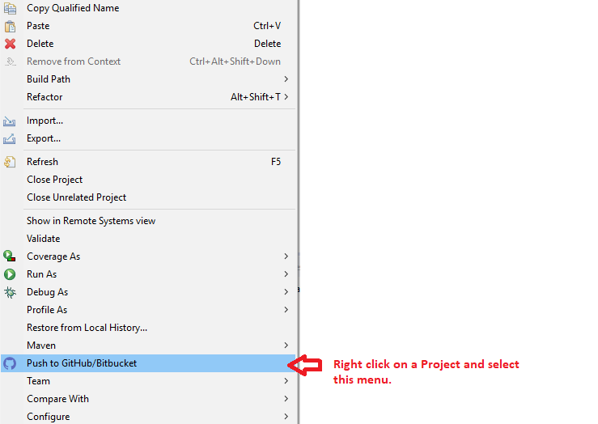
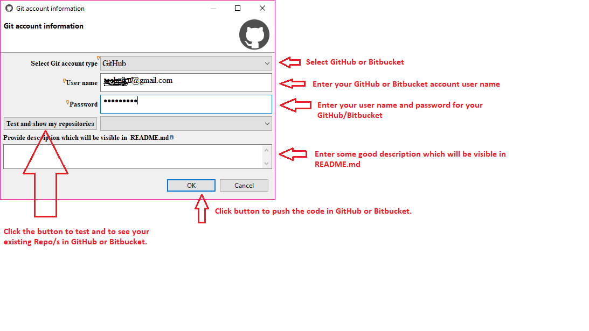
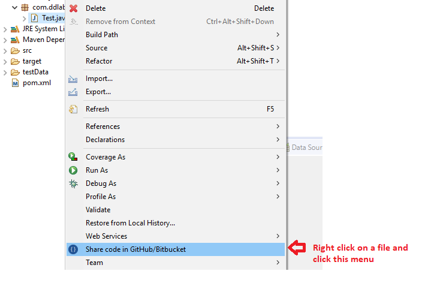
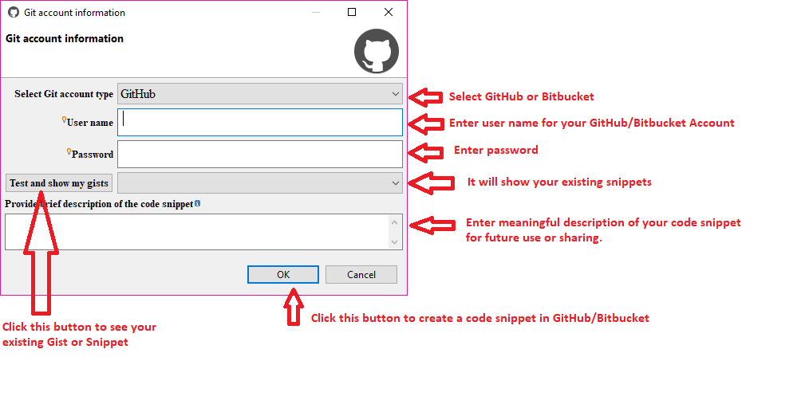

 

Eclipse Plugin to publish your code in GitHub, GitLab or Bitbucket
==========================================================================================

Introduction
============
**Code Publisher** is an eclipse plugin which helps in publishing and sharing the complete codebase or code snippet directly to GitHub, GitLab or Bitbucket. This plugin does not provide any git functionality, it only provides an easy way to keep the code in GitHub, GitLab or Bitbucket for future references. Many times, developers write good code for some POC and code goes into lost world after some time. This plugin will help you to save and share your code in GitHub, GitLab or Bitbucket.

Advantages of Code Publisher
============================

* **A hassle free way to publish code base in GitHub, GitLab or Bitbucket.**
* **Easy to create a code snippet and share with your friends.**
* **A non blocking way to publish the code or code snippet.**
* **Easy to work as it has been developed using pure java and it is free and open source.**

Technology Stack
================
The following framework/s and tool/s have been used in this current sample application.

<table border="1">
  <tr>
    <th>Name</th>
    <th>Version</th> 
  </tr>
  <tr>
    <td>Java</td>
    <td>1.8</td> 
  </tr>
  <tr>
    <td>Eclipse framework (SWT & JFace) with Oxygen</td>
    <td>3.0.9</td> 
  </tr>
  <tr>
    <td>Eclipse tycho</td>
    <td>1.2.0</td> 
  </tr>
  <tr>
    <td>Eclipse eGit framework</td>
    <td>5.2</td> 
  </tr>
</table>

How to use it ?
===============
Install using the below button.

<table style="border: none; width:100%">
  <tbody>
    <tr style="border:none;">
      <td style="vertical-align: middle; padding-top: 10px; border: none;">
        
      </td>
      <td style="vertical-align: middle; text-align: left; border: none;">
        ← Drag it to your eclipse workbench to install!</td>
    </tr>
  </tbody>
</table>

or 

use `https://dl.bintray.com/debajava/codepublisher/` in Help -> Install New Software ... Dialog.

or

Please Download  from the latest download directory.

Download the zip file and install as in Help -> Install New Software -> Add... -> Archive... Dialog.

See the screenshots give below to know its usage.

* **To create a project in GitHub/GitLab/Bitbucket**

* **To create a Gist in GitHub or Snippet in GitLab or Bitbucket**

Bugs and Feedback
=================
There may be some bugs or error, please feel free to report to me at deba.java@gmail.com

Contributor
==========
@Author : **Debadatta Mishra (PIKU)** [Know me](https://about.me/debadattamishra)

Conclusion
==========
Hope you have enjoyed my small utility plugin, try to learn and explore more and share with all.

